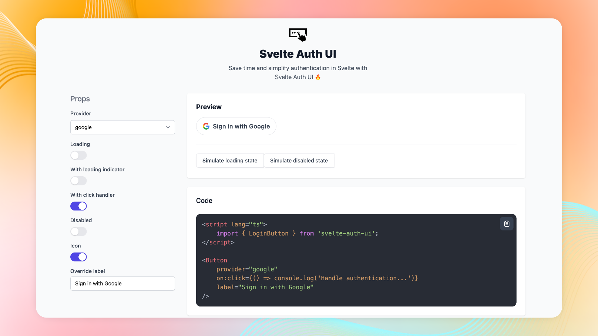

# Svelte Auth UI

Svelte Auth UI is a set of authentication components for [Svelte](https://svelte.dev/). These components are designed to simplify implementing authentication in your Svelte app.



Add social login buttons for popular services like Twitter, Facebook, and Google with just a few lines of code.

Out of the box you get a set of sane defaults to get you up and running quickly. Start implementing auth logic, instead of worrying about UI.

Overriding components with your own Tailwind classes is as easy as adding a class attribute to the component. With this flexibility, you can easily tailor the components to match your app's unique design and branding.

## Roadmap

> **Warning**
> This is work in progress. You can follow the progress on Twitter [@itschrisjayden](https://twitter.com/itschrisjayden.

### Login button

- [x] ~Pinterest~
- [x] ~Twitter~
- [x] ~Google~
- [x] ~Facebook~
- [x] ~Github~

## Installation

To install Svelte Auth UI, run the following command:

```bash
  npm install -D svelte-auth-ui@latest

  # pnpm add -D svelte-auth-ui@latest
  # yarn add -D svelte-auth-ui@latest
```

### Update your tailwind.config

```js
const config = {
	content: [
		'./src/**/*.{html,js,svelte,ts}',
		'./node_modules/svelte-auth-ui/**/*.{html,js,svelte,ts}' // 👈 Add this line
	],

	theme: {
		extend: {}
	},

	plugins: [],
	darkMode: 'class'
};

module.exports = config;
```

## Usage

```svelte
<script>
	import { LoginButton } from 'svelte-auth-ui';
</script>

<LoginButton provider="google" />
```

Please refer to the docs to see all the available props.

## License

Licensed under the [MIT license](https://github.com/shadcn/ui/blob/main/LICENSE.md).
